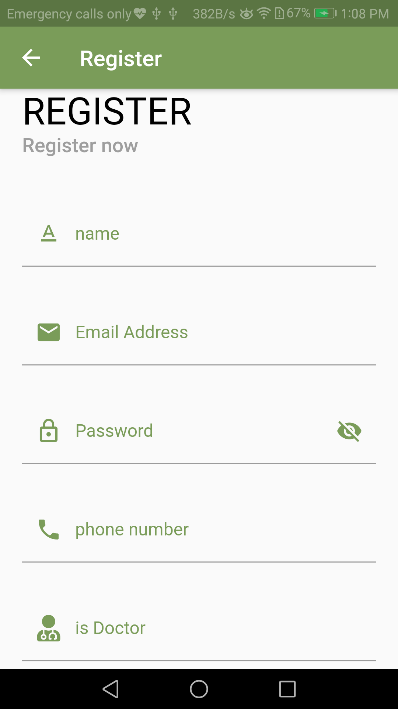
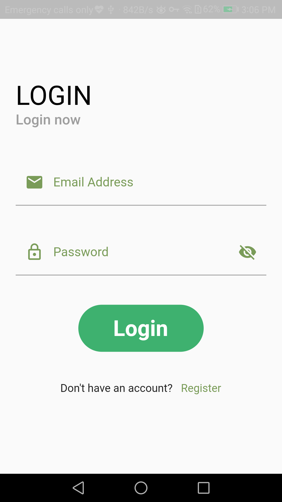
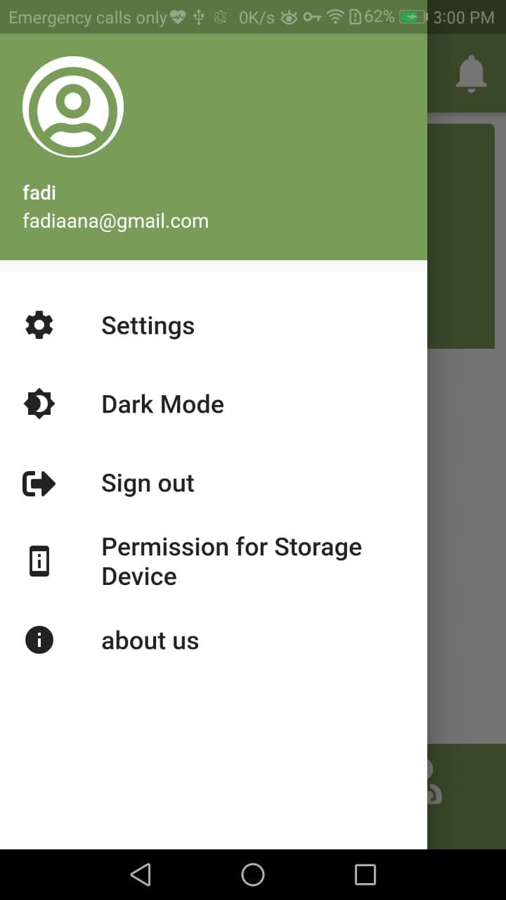

# MediMinder
MediMinder App that helps patients reminder them of medication.
## About
 - MediMinder app using `cubit` state management , `MVVM` architecture.
 - using `Firebase` as a backend.

## Services 
there are two users:

- doctor
  - Register as a doctor
  - Show medicine list
  - Edit medicine list (Add , Delete)
  - Edit a specific medicine
  - Show patients list
  - Edit patients list (Add , Delete)
    
- patient
  - Register
  - Show medicine list
  - Edit medicine list (Add , Delete)
  - Edit a specific medicine
  - Add doctor to my list (as a supervisor)
  - Edit doctors list (Add , Delete)
## ScreenShot
  
  
